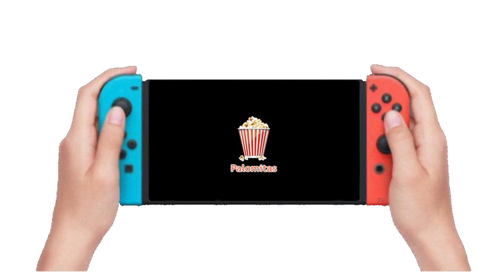

# Logo-para-switch.Palomitas 14.x.x
Logo para switch by D3fau4 y Kronos2308 -.- 
 
This windows script will create multiple ips files
that you must put in the sd to be loaded with the cfw
this will replace the Nintendo switch logo with a custom one 
[Downloads](https://github.com/StarDustCFW/Logo-para-switch.Palomitas/releases) 

## Data
The data files are just the BuildID(64chars) and the offset 

### Credits
* [friedkeenan](https://github.com/friedkeenan/switch-logo-patcher)
* [D3fau4](https://github.com/D3fau4)
* Kronos2308
* ...
* ToDo
